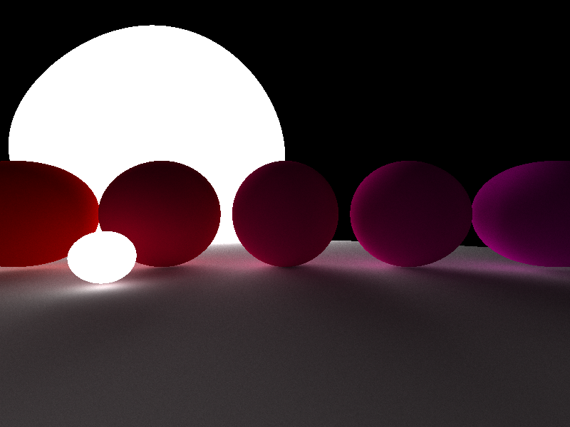

# Scene
- 1 Large ball (ground)
- 5 Medium balls of varying color unlit rough surface
- 2 Large lit balls one in scene one behind camera
- 1 Small lit ball in front of scene

# Settings For Renders
- 100&deg; Field Of View(FOV)
- 5 bounces
- 4096 Samples Per Pixel (SPP)
- 800x600 Pixel Resolution

# Computer Specs For Renders
- AMD R9 5900X (24 threads)

# Renders

## Initial Render Single Threaded (588.117s)

First render completed when implementation was first completed, no optimisations all running on one thread.

## Multithreaded implementation 24 threads (39.567s 14.86x faster)

The first optimisation I completed was implementing multi-threading. This isn't a code optimisation but allows the raytracer to use the full capabilities of the CPU.

